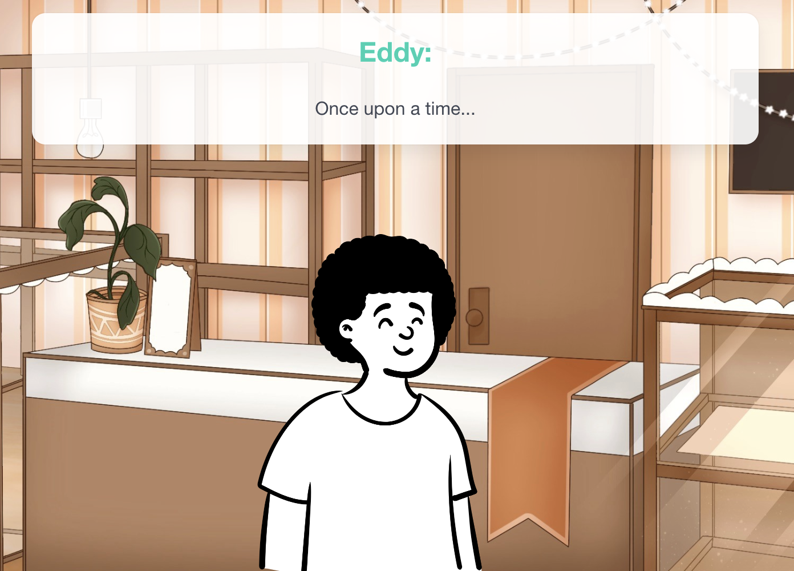

# Visual Ink

Building visual novels with Ink from Inkle.

If you just want to _use_ Visual Ink, you're probably best off going to [the official server](https://visualink.mavnn.eu/). You can log in freely with a Google account, or with an invite code using username and password. (Email michael@mavnn.eu if you'd like an invite).

We're also running online courses with [Thinkers Meetup](https://www.thinkersmeetup.com/service-page/coding-games-with-a-story-ages-9-13), a long established and trusted provider of online courses for home educators and school enrichment.

If you'd like to help _improve_ Visual Ink, you're in the right place!

## What is this project?

Visual Ink is designed for helping elementary/primary to middle school age students try out creating Visual Novels. It uses the Ink narrative scripting language to let students write "scripts" for their visual novels, which they can then "run" as an interactive game:



It adds a small number of features to the Ink language:

You can specify:
- who's currently talking by setting the `speaker` variable in our Ink script
- the background music via the `music` variable
- the background scene with the `scene` variable
- an emotion for the current line of dialogue via the `#emote` tag

There's probably a few other goodies as well as we slowly expand without adding too much complexity.

Those images and music need to come from somewhere, so as well as the scripts themselves the students
can manage their collections of speakers, scenes, and music.

Scripts end up looking something like this (before all the normal branching narrative goodness that Ink offers):

```
VAR speaker = "Narrator"
VAR scene = ""
VAR music = ""

~scene = "Cafe"

The smell of coffee filled the air.

~music = "Background Jazz"
~speaker = "Eddy"

Right! I'm off to school.

See you there Elly! #emote smile

~speaker = "Elly"

See you there!

~scene = "Classroom"
~music = "Gentle piano"

~speaker = "Mr. Noone"

...and that's why we can see that Odysseus, despite the <>
trappings of a hero is really... #emote disguise
```

## You'd like to help improve and add to the lessons and tutorials?

Amazing! You don't need any set up on your own machine for that. If you know how GitHub/git work, you can open a pull request here on github and we'll review your suggestions/additions as soon as we get a moment.

If you **don't** know how GitHub works, the easiest thing to do is to create an "issue" (in the "Issues" section at the top) and tell us about your suggestion. Either put the changes into the issue, or add an attachment with the text in if you have ideas for whole new template scripts.

## Development setup

If you have  `nix` and `direnv` all of the other tooling required will be installed for you. Run
`overmind s` in the root of the project to start the application with watchers for both the Javascript
frontend (minimal as it is) and the server application.

Otherwise you'll need PostgreSQL running and to set the PGHOST and PGPASSWORD environment variables
to run the application. Check the `Procfile` in the root of the directory for the commands to start
the dotnet and rollup watchers for a smooth development experience.

## Want to host Visual Ink yourself

You'll want to a) know what you're doing as there's no instructions right now and b) branch the project so you can replace the information pages ([see here](./content/infoPages/)) so that you're not claiming to be me.

## Future goals

These currently fall into three main categories:

- A full set of tutorials to lead club leaders and teachers through using Ink so that the students can build fun games with good stories (and learn a bunch about programming and story telling in the process!)
- The ability to "publish" games so that the students can share links to finished projects for other people to play the games they've made
- Adding the concept of a "class" with a "leader" who can few the games their students are making, and publish shared resources that are available to only their class

And, of course, there's still a bunch of UI polish needed on the front end, especially for giving feedback when things don't work!
